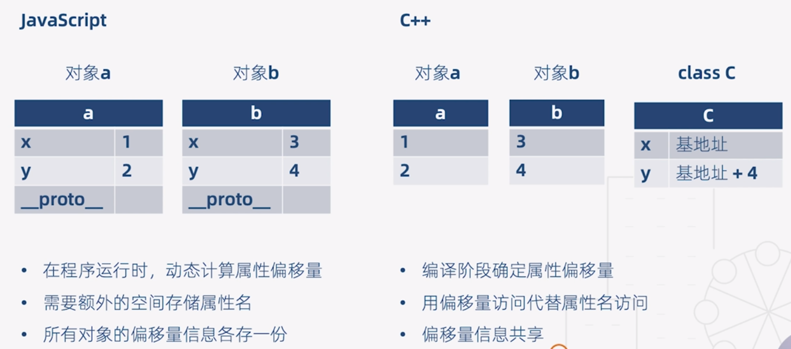
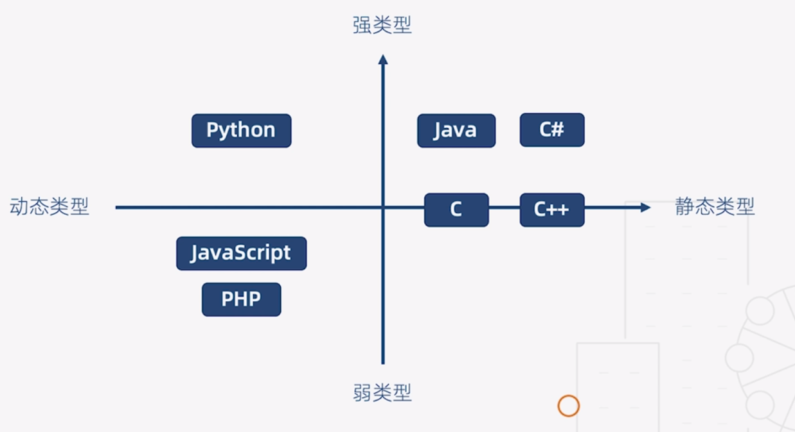

# 《`TypeScript` 开发实战》学习笔记


## 03. 类型基础（2）：动态类型与静态类型 (05:07)

### 3.1. 通俗解释

|   类　型   | 确认所有变量类型的阶段 |
| :--------: | :--------------------: |
| 强类型语言 |        编译阶段        |
| 弱类型语言 |        执行阶段        |

### 3.2. 代码对比

`Javascript`：运行时方能确定 a、b 的具体类型

```javascript
class C {
    constructor(x, y) {
        this.x = x;
        this.y = y;
    }
}
function add(a, b) {
    return a.x + a.y + b.x + b.y;
}
```

`C++`：编译阶段就能确定 a 与 b 的类型

```c++
class C {
    public:
    	int x;
    	int y;
}
int add(C a, C b) {
    return a.x + a.y + b.x + b.y;
}
```


### 3.3. 内存分配对比



> **结论**
>
> 动态类型语言无论是从时间上还是空间上，**都有比较多的性能损耗**。


### 3.4. 特点对比

|      语言      |      静态类型语言      |       动态类型语言       |
| :------------: | :--------------------: | :----------------------: |
|  **类型要求**  |        极度严格        |         非常宽松         |
|  **调试Bug**   |        立即发现        | Bug 可能隐藏数月甚至数年 |
| **运行时性能** |           好           |            差            |
|   **可读性**   | 强，可实现**自文档化** |            差            |


动态类型语言的支持者认为：

- 性能是可以改善的（V8 引擎），而语言的灵活性更重要
- 隐藏的错误可以通过单元测试发现
- 文档可以通过工具生成

可见语言特性具有两面性，其优劣对比不能一概而论。


### 3.5. 其他定义

> **强类型语言**
>
> 不允许程序在发生错误后继续执行

争议：C/C++是强类型还是弱类型？（未考虑下标越界的情况）


### 3.6. 语言类型象限图




edited by ***Anton*** -- 1:41 2019/7/29

