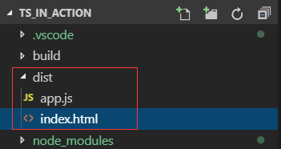

# 《`TypeScript` 开发实战》学习笔记

[TOC]

## 04. 编写你的第一个 `TypeScript` 程序 (15:01)

### 4.1. 预装工具

- **Visual Studio Code**（Version: 1.36.1 (user setup)）
- **Node.js**（v6.9.0）


### 4.2. 实战演练过程

1. 从 `GitHub` 下拉本课课件：

```shell
andon@Sinosoft-Zhouad MINGW64 ~/Courses
$ git clone git@github.com:SafeWinter/typescript-in-action.git TypeScriptInAction
Cloning into 'TypeScriptInAction'...
remote: Enumerating objects: 85, done.
remote: Counting objects: 100% (85/85), done.
remote: Compressing objects: 100% (65/65), done.
remote: Total 85 (delta 16), reused 73 (delta 11), pack-reused 0
Receiving objects: 100% (85/85), 8.24 MiB | 802.00 KiB/s, done.
Resolving deltas: 100% (16/16), done.

andon@Sinosoft-Zhouad MINGW64 ~/Courses
$ cd TypeScriptInAction/

andon@Sinosoft-Zhouad MINGW64 ~/Courses/TypeScriptInAction (master)
$
```


2. 创建文件夹 `ts_in_action` 并初始化node，参数 `-y` 表示默认所有提示项均选择 **yes**：

```bash
andon@Sinosoft-Zhouad MINGW64 ~/Courses/TypeScriptInAction (with_learning_notes)
$ mkdir ts_in_action; cd ts_in_action/;

andon@Sinosoft-Zhouad MINGW64 ~/Courses/TypeScriptInAction/ts_in_action (with_learning_notes)
$ npm init -y
Wrote to C:\Users\andon\Courses\TypeScriptInAction\ts_in_action\package.json:

{
  "name": "ts_in_action",
  "version": "1.0.0",
  "description": "",
  "main": "index.js",
  "scripts": {
    "test": "echo \"Error: no test specified\" && exit 1"
  },
  "keywords": [],
  "author": "",
  "license": "ISC"
}


andon@Sinosoft-Zhouad MINGW64 ~/Courses/TypeScriptInAction/ts_in_action (with_learning_notes)
$

```

可以看到，系统自动生成一个 `package.json` 的文件。


3. 安装 `TypeScript`，参数 `-g` 表示全局安装，这样当前用户在任意位置都能使用 `TypeScript` 的编译命令（ `tsc` 命令）：

```shell
andon@Sinosoft-Zhouad MINGW64 ~/Courses/TypeScriptInAction/ts_in_action (with_learning_notes)
$ npm i typescript -g
C:\Users\andon\AppData\Roaming\npm\tsserver -> C:\Users\andon\AppData\Roaming\npm\node_modules\typescript\bin\tsserver
C:\Users\andon\AppData\Roaming\npm\tsc -> C:\Users\andon\AppData\Roaming\npm\node_modules\typescript\bin\tsc
+ typescript@3.5.3
updated 1 package in 1.397s

andon@Sinosoft-Zhouad MINGW64 ~/Courses/TypeScriptInAction/ts_in_action (with_learning_notes)
$
```


4. 安装完毕可以试运行 `tsc -h` 查看 `tsc` 命令的参数概况，这些配置项大多可以通过一个配置文件进行设置，运行以下命令初始化 `TypeScript` 配置文件：

```shell
andon@Sinosoft-Zhouad MINGW64 ~/Courses/TypeScriptInAction/ts_in_action (with_learning_notes)
$ tsc --init
message TS6071: Successfully created a tsconfig.json file.

andon@Sinosoft-Zhouad MINGW64 ~/Courses/TypeScriptInAction/ts_in_action (with_learning_notes)
$
```

执行完毕后，当前目录下自动生成一个 `tsconfig.json` 文件。


5. 使用 `tsc` 命令编译文件 `./src/index.ts`，内容为：`let hello : string = "Hello TypeScript"`，表示声明了一个名为 `hello` 的字符串

```shell
andon@Sinosoft-Zhouad MINGW64 ~/Courses/TypeScriptInAction/ts_in_action (with_learning_notes)
$ mkdir src; touch ./src/index.ts; echo 'let hello : string = "Hello TypeScript";' >> ./src/index.ts

andon@Sinosoft-Zhouad MINGW64 ~/Courses/TypeScriptInAction/ts_in_action (with_learning_notes)
$ tsc src/index.ts

andon@Sinosoft-Zhouad MINGW64 ~/Courses/TypeScriptInAction/ts_in_action (with_learning_notes)
$
```
执行结束后，原文件旁边自动创建了一个编译成 `JavaScript` 的文件 `index.js`，内容为：`var hello = "Hello TypeScript";`

也可以利用 `TypeScript` 官网上的 **Playground** 模块（http://www.typescriptlang.org/play/）查看实时编译结果。


6. 配置构建工具 `webpack`

> `webpack` 在开发环境和生产环境的配置是不同的。为提高工程的可维护性，可以将**开发环境配置**、**生产环境配置**、**公共配置**分开书写，最后通过插件进行合并。

```shell
andon@Sinosoft-Zhouad MINGW64 ~/Courses/TypeScriptInAction/ts_in_action (with_learning_notes)
$ npm i webpack webpack-cli webpack-dev-server -D
npm notice created a lockfile as package-lock.json. You should commit this file.
npm WARN ts_in_action@1.0.0 No description
npm WARN ts_in_action@1.0.0 No repository field.
npm WARN optional SKIPPING OPTIONAL DEPENDENCY: fsevents@1.2.9 (node_modules\fsevents):
npm WARN notsup SKIPPING OPTIONAL DEPENDENCY: Unsupported platform for fsevents@1.2.9: wanted {"os":"darwin","arch":"any"} (current: {"os":"win32","arch":"x64"})

+ webpack-cli@3.3.6
+ webpack-dev-server@3.7.2
+ webpack@4.39.1
added 546 packages from 348 contributors and audited 8792 packages in 51.974s
found 0 vulnerabilities


andon@Sinosoft-Zhouad MINGW64 ~/Courses/TypeScriptInAction/ts_in_action (with_learning_notes)
$
```

安装过程中，创建 `build` 文件夹存放所有的配置文件（直接从仓库拷贝），其中：

**webpack.config.js**：所有配置文件的**入口**；

**webpack.base.config.js**：**公共环境**的配置文件；

**webpack.dev.config.js**：**开发环境**的配置文件；

**webpack.pro.config.js**：**生产环境**的配置文件；

```shell
andon@Sinosoft-Zhouad MINGW64 ~/Courses/TypeScriptInAction/ts_in_action (with_learning_notes)
$ mkdir build; cp ../sourcecode/ts-base/build/*.js ./build/;

andon@Sinosoft-Zhouad MINGW64 ~/Courses/TypeScriptInAction/ts_in_action (with_learning_notes)
$
```

**公共配置**：

`module.exports.entry = './src/index.js'`（项目入口）

`module.exports.output.filename = 'app.js'`（输出的文件名，路径默认为`dist`）

`module.exports.resolve.extensions = ['.js', '.ts', '.tsx']`（可解析的文件扩展名）

`module.exports.module.rules[0].test = '/\.tsx?$/i'`（ts加载器识别的文件扩展名）

`module.exports.module.rules[0].use[0].loader = 'ts-loader'`（ts加载器名称）

`module.exports.module.rules[0].exclude = /node_modules/`（无需加载器检索的路径）

因此需要安装 `TypeScript` 的加载器 `ts-loader`，这里需要重新手动安装 `TypeScript`：

```shell
andon@Sinosoft-Zhouad MINGW64 ~/Courses/TypeScriptInAction/ts_in_action (with_learning_notes)
$ npm i ts-loader typescript -D
npm WARN ts_in_action@1.0.0 No description
npm WARN ts_in_action@1.0.0 No repository field.
npm WARN optional SKIPPING OPTIONAL DEPENDENCY: fsevents@1.2.9 (node_modules\fsevents):
npm WARN notsup SKIPPING OPTIONAL DEPENDENCY: Unsupported platform for fsevents@1.2.9: wanted {"os":"darwin","arch":"any"} (current: {"os":"win32","arch":"x64"})

+ ts-loader@6.0.4
+ typescript@3.5.3
added 9 packages from 21 contributors and audited 8828 packages in 10.37s
found 0 vulnerabilities


andon@Sinosoft-Zhouad MINGW64 ~/Courses/TypeScriptInAction/ts_in_action (with_learning_notes)
$
```


然后需要安装 `HtmlWebpackPlugin`，它用于生成基于某个模板文件的网站首页，同时可以将输出文件自动注入该首页文件中，`template` 指定了模板文件的路径：

```json
plugins: [
    new HtmlWebpackPlugin({
        template: './src/tpl/index.html'
    })
]
```

```shell
andon@Sinosoft-Zhouad MINGW64 ~/Courses/TypeScriptInAction/ts_in_action (with_learning_notes)
$ npm i html-webpack-plugin -D
npm WARN ts_in_action@1.0.0 No description
npm WARN ts_in_action@1.0.0 No repository field.
npm WARN optional SKIPPING OPTIONAL DEPENDENCY: fsevents@1.2.9 (node_modules\fsevents):
npm WARN notsup SKIPPING OPTIONAL DEPENDENCY: Unsupported platform for fsevents@1.2.9: wanted {"os":"darwin","arch":"any"} (current: {"os":"win32","arch":"x64"})

+ html-webpack-plugin@3.2.0
added 51 packages from 68 contributors and audited 8907 packages in 14.426s
found 0 vulnerabilities


andon@Sinosoft-Zhouad MINGW64 ~/Courses/TypeScriptInAction/ts_in_action (with_learning_notes)
$
```

根据公共配置，创建模板文件 `./src/tpl/index.html` ：

```shell
andon@Sinosoft-Zhouad MINGW64 ~/Courses/TypeScriptInAction/ts_in_action (with_learning_notes)
$ mkdir ./src/tpl; touch ./src/tpl/index.html

andon@Sinosoft-Zhouad MINGW64 ~/Courses/TypeScriptInAction/ts_in_action (with_learning_notes)
$
```

`./src/tpl/index.html` 内容如下：

```html
<!DOCTYPE html>
<html lang="en">
<head>
    <meta charset="UTF-8">
    <meta name="viewport" content="width=device-width, initial-scale=1.0">
    <meta http-equiv="X-UA-Compatible" content="ie=edge">
    <title>TypeScript in Action</title>
</head>
<body>
    <div class="app"></div>
</body>
</html>
```


**开发环境配置**：

```json
module.exports = {
    devtool: 'cheap-module-eval-source-map'
}
```

这是官方推荐配置，其中：

**cheap**：表示 `source-map` 会忽略列信息（调试时无用）

**module**：表示会定位到 `TypeScript` 源码，而不是经过 `ts-loader` 转义后的 `JavaScript` 源码

**eval-source-map**：表示会将 `source-map` 以`DataURL` 的形式打包到文件中，其重编译速度是很快的，不必担心性能问题


**生产环境配置**：

需要安装插件 `CleanWebpackPlugin`，作用是在每次成功构建完成后，自动清空 `dist` 目录。该文件夹中，有时为了避免缓存，需要在文件后加入哈希，因此在多次构建后会产生很多无用文件。

```shell
andon@Sinosoft-Zhouad MINGW64 ~/Courses/TypeScriptInAction/ts_in_action (with_learning_notes)
$ npm i clean-webpack-plugin -D
npm WARN ts_in_action@1.0.0 No description
npm WARN ts_in_action@1.0.0 No repository field.
npm WARN optional SKIPPING OPTIONAL DEPENDENCY: fsevents@1.2.9 (node_modules\fsevents):
npm WARN notsup SKIPPING OPTIONAL DEPENDENCY: Unsupported platform for fsevents@1.2.9: wanted {"os":"darwin","arch":"any"} (current: {"os":"win32","arch":"x64"})

+ clean-webpack-plugin@3.0.0
added 7 packages from 57 contributors and audited 8962 packages in 9.896s
found 0 vulnerabilities


andon@Sinosoft-Zhouad MINGW64 ~/Courses/TypeScriptInAction/ts_in_action (with_learning_notes)
$
```


**总配置文件**：（入口）

需要安装插件 webpack-merge， 用于合并配置文件：

```shell
andon@Sinosoft-Zhouad MINGW64 ~/Courses/TypeScriptInAction/ts_in_action (with_learning_notes)
$ npm i webpack-merge -D
npm WARN ts_in_action@1.0.0 No description
npm WARN ts_in_action@1.0.0 No repository field.
npm WARN optional SKIPPING OPTIONAL DEPENDENCY: fsevents@1.2.9 (node_modules\fsevents):
npm WARN notsup SKIPPING OPTIONAL DEPENDENCY: Unsupported platform for fsevents@1.2.9: wanted {"os":"darwin","arch":"any"} (current: {"os":"win32","arch":"x64"})

+ webpack-merge@4.2.1
added 1 package from 1 contributor and audited 8964 packages in 8.806s
found 0 vulnerabilities


andon@Sinosoft-Zhouad MINGW64 ~/Courses/TypeScriptInAction/ts_in_action (with_learning_notes)
$
```

然后设置具体配置：

```json
const merge = require('webpack-merge')
const baseConfig = require('./webpack.base.config')
const devConfig = require('./webpack.dev.config')
const proConfig = require('./webpack.pro.config')

module.exports = (env, argv) => {
    let config = argv.mode === 'development' ? devConfig : proConfig;
    return merge(baseConfig, config);
};
```


7. 配置 npm 脚本

- 开发环境：`npm start`（需要借助 `webpack-dev-server` ）
- 生产环境：`npm run build` （需要借助 `webpack`）

需要修改 `node` 配置文件 `package.json`：

`main = './src/index.ts'`

`scripts.start = 'webpack-dev-server --mode=development --config ./build/webpack.config.js'`

`scripts.build = 'webpack --mode=production --config ./build/webpack.config.js'`

配置结束。

运行开发环境的启动命令 `npm start` ：

```zsh
andon@Sinosoft-Zhouad MINGW64 ~/Courses/TypeScriptInAction/ts_in_action (with_learning_notes)
$ npm start

> ts_in_action@1.0.0 start C:\Users\andon\Courses\TypeScriptInAction\ts_in_action
> webpack-dev-server --mode=development --config ./build/webpack.config.js

i ｢wds｣: Project is running at http://localhost:8080/
i ｢wds｣: webpack output is served from /
i ｢wds｣: Content not from webpack is served from C:\Users\andon\Courses\TypeScriptInAction\ts_in_action
i ｢wdm｣: Hash: ef58c071ccf63a64e54e
Version: webpack 4.39.1
Time: 2847ms
Built at: 2019-08-03 8:17:45 PM
     Asset       Size  Chunks             Chunk Names
    app.js    887 KiB    main  [emitted]  main
index.html  362 bytes          [emitted]
Entrypoint main = app.js
[0] multi (webpack)-dev-server/client?http://localhost ./src/index.ts 40 bytes {main} [built]
[./node_modules/ansi-html/index.js] 4.16 KiB {main} [built]
[./node_modules/html-entities/index.js] 231 bytes {main} [built]
[./node_modules/loglevel/lib/loglevel.js] 7.68 KiB {main} [built]
[./node_modules/querystring-es3/index.js] 127 bytes {main} [built]
[./node_modules/webpack-dev-server/client/index.js?http://localhost] (webpack)-dev-server/client?http://localhost 4.29 KiB {main} [built]
[./node_modules/webpack-dev-server/client/overlay.js] (webpack)-dev-server/client/overlay.js 3.51 KiB {main} [built]
[./node_modules/webpack-dev-server/client/socket.js] (webpack)-dev-server/client/socket.js 1.53 KiB {main} [built]
[./node_modules/webpack-dev-server/client/utils/createSocketUrl.js] (webpack)-dev-server/client/utils/createSocketUrl.js 2.77 KiB {main} [built]
[./node_modules/webpack-dev-server/client/utils/log.js] (webpack)-dev-server/client/utils/log.js 964 bytes {main} [built]
[./node_modules/webpack-dev-server/client/utils/reloadApp.js] (webpack)-dev-server/client/utils/reloadApp.js 1.63 KiB {main} [built]
[./node_modules/webpack-dev-server/client/utils/sendMessage.js] (webpack)-dev-server/client/utils/sendMessage.js 402 bytes {main} [built]
[./node_modules/webpack-dev-server/node_modules/strip-ansi/index.js] (webpack)-dev-server/node_modules/strip-ansi/index.js 161 bytes {main} [built]
[./node_modules/webpack/hot sync ^\.\/log$] (webpack)/hot sync nonrecursive ^\.\/log$ 170 bytes {main} [built]
[./src/index.ts] 48 bytes {main} [built]
    + 18 hidden modules
Child html-webpack-plugin for "index.html":
     1 asset
    Entrypoint undefined = index.html
    [./node_modules/html-webpack-plugin/lib/loader.js!./src/tpl/index.html] 528 bytes {0} [built]
    [./node_modules/lodash/lodash.js] 528 KiB {0} [built]
    [./node_modules/webpack/buildin/global.js] (webpack)/buildin/global.js 472 bytes {0} [built]
    [./node_modules/webpack/buildin/module.js] (webpack)/buildin/module.js 497 bytes {0} [built]
i ｢wdm｣: Compiled successfully.

```

运行情况如下：


此时修改源文件 `index.ts`，将变量 `hello` 写入主页的 `div` 中：

```typescript
let hello : string = "Hello TypeScript";
document.querySelectorAll(".app")[0].innerHTML = hello;
```

网页无需刷新，内容已自动更新：


运行生产环境的构建脚本命令 `npm run build` ：

```shell
andon@Sinosoft-Zhouad MINGW64 ~/Courses/TypeScriptInAction/ts_in_action (with_learning_notes)
$ npm run build

> ts_in_action@1.0.0 build C:\Users\andon\Courses\TypeScriptInAction\ts_in_action
> webpack --mode=production --config ./build/webpack.config.js

Hash: 6152ca6cdacf7adfd764
Version: webpack 4.39.1
Time: 2854ms
Built at: 2019-08-03 8:35:38 PM
     Asset        Size  Chunks             Chunk Names
    app.js  1010 bytes       0  [emitted]  main
index.html   362 bytes          [emitted]
Entrypoint main = app.js
[0] ./src/index.ts 105 bytes {0} [built]
Child html-webpack-plugin for "index.html":
     1 asset
    Entrypoint undefined = index.html
    [0] ./node_modules/html-webpack-plugin/lib/loader.js!./src/tpl/index.html 528 bytes {0} [built]
    [2] (webpack)/buildin/global.js 472 bytes {0} [built]
    [3] (webpack)/buildin/module.js 497 bytes {0} [built]
        + 1 hidden module

andon@Sinosoft-Zhouad MINGW64 ~/Courses/TypeScriptInAction/ts_in_action (with_learning_notes)
$
```

执行完毕后，原文件夹自动生成一个 `dist` 文件夹，里面包含构建好的 `app.js`、`index.html`，同时 `js` 文件也自动嵌入到 `index.html` 中：



```html
<!DOCTYPE html>
<html lang="en">
<head>
    <meta charset="UTF-8">
    <meta name="viewport" content="width=device-width, initial-scale=1.0">
    <meta http-equiv="X-UA-Compatible" content="ie=edge">
    <title>TypeScript in Action</title>
</head>
<body>
    <div class="app"></div>
<script type="text/javascript" src="app.js"></script></body>
</html>
```


### 4.3. 执行命令汇总

```shell
$ npm init -y
$ npm i typescript -g
$ tsc --init

$ mkdir src
$ touch ./src/index.ts
$ echo 'let hello : string = "Hello TypeScript";' >> ./src/index.ts

$ tsc src/index.ts
$ npm i webpack webpack-cli webpack-dev-server -D

$ mkdir build
$ cp ../sourcecode/ts-base/build/*.js ./build/

$ npm i ts-loader typescript -D
$ npm i html-webpack-plugin -D

$ mkdir ./src/tpl
$ touch ./src/tpl/index.html

$ npm i clean-webpack-plugin -D
$ npm i webpack-merge -D

$ npm start
$ npm run build
```


edited by ***Anton*** -- 20:49 2019/8/3

