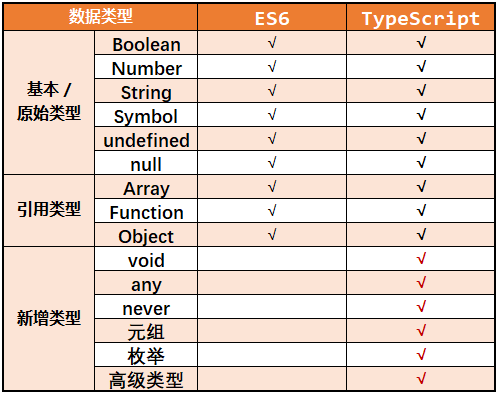
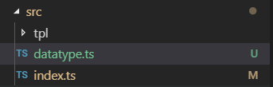

# 《`TypeScript` 开发实战》学习笔记

[TOC]

## 05. 基本类型 (14:24)

### 5.1. *ES6 的数据类型* vs *TypeScript的数据类型*




### 5.2. 类型注解

#### 作用

​		相当于类型声明（强类型语言中）


#### 语法

​		`(variable / function) : type`


### 5.3. 具体数据类型详解

#### 5.3.0. 准备工作

启动上一课创建的项目，将原始课件拷贝至项目 `./src/` 文件夹下，并在 `./src/index.ts` 中引入该 `ts` 文件，通过查看浏览器控制台进行学习：



引入 `datatype.ts` 后的 `index.html` 文件：

```typescript
import "./datatype"

let hello : string = "Hello TypeScript";
document.querySelectorAll(".app")[0].innerHTML = hello;
```


#### 5.3.1. 原始类型

```typescript
let bool: boolean = true
let num: number = 123
let str: string = 'abc'
// str = 123    // Error: Type '123' is not assignable to type 'string'. 
                // 可见变量的数据类型是不能更改的
```


#### 5.3.2. 数组

```typescript
let arr1: number[] = [1, 2, 3]
let arr2: Array<number> = [1, 2, 3]  // Array 是 TypeScript 预定义的泛型接口
// let arr3: Array<number> = [4,5,6,'a'];   // Error: Type 'string' is not assignable to type 'number'.
                                            // 可见数组元素的类型不可随意变更，除非使用【联合类型】
```

##### 联合类型的声明
```typescript
// 联合类型
let arr4: (number | string) [] = [1, 2, 3, '4'];
let arr5: Array<number | string> = [1, 2, 3, '4'];
```


#### 5.3.3. 元组

```typescript
// 元组
// 是一种特殊的数组，限定了数组元素的类型与个数
let tuple: [number, string] = [1, '2'];
```

##### 元组越界问题

```typescript
// 声明元祖类型后，不可随意添加内容
// let tuple1: [number, string] = [1, '2', 'abc'];  // Error: Type '[number, string, string]' is not assignable to type '[number, string]'.
//          Types of property 'length' are incompatible.
//            Type '3' is not assignable to type '2'.

// 但元祖支持 push 方法：
tuple.push('elem1')
tuple.push(333)

// 只是不允许直接越界访问：
console.log(tuple);         // (4) [1, "2", "elem1", 333]
console.log(tuple[0]);      // 1
console.log(tuple[1]);      // '2'
// console.log(tuple[2]);  // Error: Tuple type '[number, string]' of length '2' has no element at index '2'.

// 除非使用 for...in 循环：
for(let index in tuple) {
    console.log('index:',index,'tuple[index]:',tuple[index]);
}
// index: 0 tuple[index]: 1
// index: 1 tuple[index]: '2'
// index: 2 tuple[index]: 'elem1'
// index: 3 tuple[index]: 333

// 实际开发过程中，强烈不建议这样使用元祖
```


#### 5.3.4. 函数

```typescript
// 函数
let add = (x: number, y: number) => x + y

// 也可以显式声明返回值的类型
let add1 = (x: number, y: number):number => x + y

// 定义一个函数类型，不用实现
let compute: (x: number, y: number) => number

// 后期实现过程中，不必再指定类型，参数名也可以不同：
compute = (a, b) => a + b
```


#### 5.3.5. 对象

```typescript
// 对象
let obj : object = { x: 1, y: 2 }
// obj.x = 3;  // Error: Property 'x' does not exist on type 'object'.
               // object 中需显式声明属性 x、y 的类型
// 正确写法：
let obj1 : {x:number, y:number} = {x: 1, y: 2}
obj1.x = 3;
obj1.y = 6;
```


#### 5.3.6. symbol 类型

```typescript
// symbol 类型
// 含义：具有唯一的值
let s1: symbol = Symbol()
let s2 = Symbol()
console.log('s1 === s2: ' + (s1 === s2));   // s1 === s2: false
```


#### 5.3.7. undefined, null 类型

```typescript
// undefined, null
// 可以将变量的类型声明为 undefined 或 null
let un: undefined = undefined
let nu: null = null

// 一经声明，该变量就不允许被赋值为其他数据类型，其取值只能为其本身
// let un1: undefined = 1;     // Error: Type '1' is not assignable to type 'undefined'.
// let un1: undefined = 'a';   // Error: Type '"a"' is not assignable to type 'undefined'.

// 反之，对已经声明类型的变量（例如 obj ）也不能轻易赋值为 undefined 或 null：
// obj = undefined     // Error: Type 'undefined' is not assignable to type 'object'.
// obj = null          // Error: Type 'null' is not assignable to type 'object'.

// 根据 TypeScript 官方文档，undefined 与 null 是任何类型的子类型，
// 因此它们是可以赋给其他数据类型的变量的，只是需要修改默认设置，禁用严格模式下的空值检查即可：
// jsconfig.json 中的 "strictNullChecks": false

// 要想在严格模式下（默认）赋值 undefined / null 时不报错，目标变量只能声明为联合类型：
let obj2:{a:number, b:number} | undefined | null = {a: 10, b: 20}
obj2 = undefined;
obj2 = null;
```


#### 5.3.8. void 类型

```typescript
// void 类型
//   void 在 JavaScript 中是一个操作符，它可以让任何表达式返回 undefined
//   常见用法为 void 0：
console.log(void 0);     // 返回 undefined

    // 设置 void 类型的原因，是 undefined 不是一个保留字
    // 我们甚至可以定义一个名为 undefined 的变量，用其值来覆盖全局的 undefined：
    (function(){
        let undefined = 1;
        console.log('undefined = ', undefined);     // undefined =  1
                                                    // 全局的 undefined 被自定义变量值覆盖
    })()

// TypeScript 中的 void 类型表示没有任何返回值的类型，例如一个没有任何返回值的函数，其类型就是 void 型：
let noReturn = () => {}
```


#### 5.3.9. any 类型

```typescript
// any 类型
// 如果不指定变量类型，则默认为 any 类型，与 js 无异，它可以被赋予任何值：
let x
x = 1
x = []
x = () => {}

// 若非特殊情况，通常不建议使用 any 类型，否则也不必使用 TypeScript 了
```


#### 5.3.10. never 类型

```js
// never 类型
// 表示永远不会有返回值的类型

// 情形1：一个抛出了异常的函数：
let error = () => {
    throw new Error('error')
}

// 情形2：死循环函数：
let endless = () => {
    while(true) {}
}
```


### 5.4. 小结

- `TypeScript` 的基本数据类型完全覆盖了 ES6 中的数据类型，并且通过 `any` 类型实现了对 `JavaScript` 的兼容；
- 为一个变量或函数声明类型是一个非常好的编程习惯，这对后端开发稀松平常，但对前端开发而言，却是建立类型思维的开始。


edited by ***Anton*** -- 12:34 2019/8/4