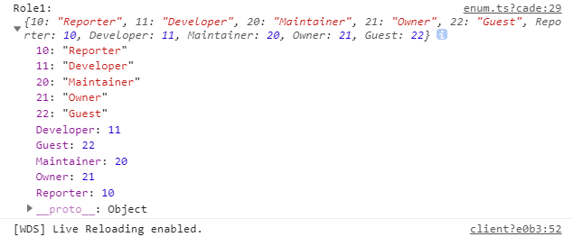

# 《`TypeScript` 开发实战》学习笔记

[TOC]

## 06. 枚举类型 (11:35)

### 6.1. 示例：角色判断

```js
function initByRole(role) {
    if (role === 1 || role === 2) {
        // do sth
    } else if (role === 3 || role === 4) {
        // do sth
    } else if (role === 5) {
        // do sth
    } else {
        // do sth
    }
}
```

> **问题**
>
> 	1. **可读性差**：很难记住数字的含义
>  	2. **可维护性差**：硬编码，牵一发动全身
>
> **解决途径**
>
> ​	使用<font color="orange">**枚举类型**</font>


### 6.2. 定义

> 枚举
>
> ​	一组有名字的常量集合。

例如手机通讯录，只需记住人名，无须记住具体的电话号码（号码经常变更，但人名很少改动）


### 6.3. 分类

- 数字枚举
- 字符串枚举
- 异构枚举（不推荐）


### 6.4. 数字枚举

```typescript
// 1. 数字枚举
enum Role {
    Reporter,
    Developer,
    Maintainer,
    Owner,
    Guest
}
// 数字枚举默认从 0 开始取值
console.log('Role.Reporter:', Role.Reporter);           // Role.Reporter: 0

// 也可以手动指定起始值，其余元素的默认值按从上到下的顺序依次递增1：
enum Role1 {
    Reporter = 10,
    Developer,
    Maintainer = 20,
    Owner,
    Guest
}
console.log('Role1.Reporter:', Role1.Reporter)          // Role.Reporter: 10
console.log('Role1.Developer:', Role1.Developer)        // Role1.Developer: 11
console.log('Role1.Maintainer:', Role1.Maintainer)      // Role1.Maintainer: 20
console.log('Role1.Owner:', Role1.Owner)                // Role1.Owner: 21
console.log('Role1.Guest:', Role1.Guest)                // Role1.Guest: 22

// 枚举似乎与对象相似，直接在控制台打印将得到一个枚举对象：
console.log('Role1:', JSON.stringify(Role1, null, 2));
/* 运行结果：
Role1: {
  "10": "Reporter",
  "11": "Developer",
  "20": "Maintainer",
  "21": "Owner",
  "22": "Guest",
  "Reporter": 10,
  "Developer": 11,
  "Maintainer": 20,
  "Owner": 21,
  "Guest": 22
}
*/
```


#### 数字枚举的实现原理 - 反向映射

直接打印 `Role1` 到控制台将得到如下结果：



注意到 Role1 除了正常的枚举成员外，还伴生了另一组成员。Role1 既可以使用枚举成员的名称来索引，也可以用值来索引。将枚举类型的 ts 源码编译为对应的 js：

```js
var Role1;
(function (Role1) {
    Role1[Role1["Reporter"] = 10] = "Reporter";
    Role1[Role1["Developer"] = 11] = "Developer";
    Role1[Role1["Maintainer"] = 20] = "Maintainer";
    Role1[Role1["Owner"] = 21] = "Owner";
    Role1[Role1["Guest"] = 22] = "Guest";
})(Role1 || (Role1 = {}));
```

这样先将 key 映射到 value，再将 value 映射回 key 的处理方法，叫做“反向映射”。


### 6.5. 字符串枚举

```typescript
// 2. 字符串枚举
enum Message {
    Success = '恭喜你，成功了',
    Fail = '抱歉，失败了'
}
```

对应的 js 编译结果为：

```js
var Message;
(function (Message) {
    Message["Success"] = "\u606D\u559C\u4F60\uFF0C\u6210\u529F\u4E86";
    Message["Fail"] = "\u62B1\u6B49\uFF0C\u5931\u8D25\u4E86";
})(Message || (Message = {}));
```

这表明字符串枚举不能进行反向映射。


### 6.6. 异构枚举

```typescript
// 异构枚举（不推荐使用）
enum Answer {
    N,
    Y = 'Yes'
}
```

该用法容易引起混淆，不建议使用。


### 6.7. 枚举成员的性质

1. 枚举成员的值是只读属性的：

```typescript
// Role.Reporter = 3;  // Error: Cannot assign to 'Reporter' because it is a read-only property.
```

2. 枚举成员的分类：
   1. 常量枚举成员（const member）
   2. 计算枚举成员（computed member）

```typescript
enum Char {
    // 2.1. 常量枚举成员（const member）：在编译时进行运算
    a,
    b = Char.a,
    c = 1 + 3,
    // 2.2. 计算枚举成员（computed member）：在运行时环境进行计算
    d = Math.random(),
    e = '123'.length,
//  f       // 编译失败：(计算枚举后的)成员后必须具有初始化表达式。
    f = 4   // 编译正常
}
```

此外，计算枚举成员后的其他枚举成员，必须赋初值，否则报错。


#### 反向映射时的值覆盖问题

观察发现，`Char` 中存在值覆盖的问题，`Char.a` 与 `Char.b` 的取值都是 0，那么 `Char[0]` 的值是什么呢？

```typescript
console.log('Char[Char.a]:', Char[Char.a]);    // "b"
```

可见实际的取值以最后一个重复值的 key 为准。


### 6.8. 常量枚举

#### 定义

添加 `const enum` 关键字，其特点是在编译阶段会被移除。

```typescript
const enum Month {
    Jan,
    Feb,
    Mar,
    Apr = Month.Mar + 1,
//  May = () => 4   // Error: const enum member initializers can only contain literal values and other computed enum values.
}
```

上述声明的编译结果为空。


#### 用法

当我们不需要一个对象、只需要这个对象的值的时候，就可以考虑使用常量枚举类型，以减少编译环节的代码量：

```typescript
let month = [Month.Jan, Month.Feb, Month.Mar, Month.Apr]
```


### 6.9. 将枚举用作数据类型

某些情况下，枚举、及其成员都可以作为一种单独的数据类型存在。具体分为以下三种情况：

1. 所有成员均未指定初始值：`enum E { a, b }`
2. 所有成员均为数字型枚举：`enum F { a = 0, b = 1 }`
3. 所有成员均为字符串型枚举：`enum G { a = 'apple', b = 'banana' }`


数字型枚举可以直接赋值给任意数字值，且取值可以超出枚举成员的值域：

```typescript
let e: E = 3
let f: F = 3
```

但不同枚举类型间的变量不能进行比较：

```typescript
// console.log(e === f)     // Error: This condition will always return 'false' 
                            // since the types 'E' and 'F' have no overlap.
```

也可以声明变量类型为某个枚举成员：

```typescript
let e1: E.a = 3
let e2: E.b = 3
```

同样地，不同类型的变量 e1 与 e2 不能比较：

```typescript
// e1 === e2;               // Error: This condition will always return 'false' 
                            // since the types 'E.a' and 'E.b' have no overlap.
```

如果换成同种类型的变量，则可以比较：

```typescript
let e1: E.a = 3
let e3: E.a = 2;
console.log(e1 === e3)      // false
e3 = 3;
console.log(e1 === e3)      // true
```

而字符串枚举的取值只能是其枚举成员的取值：

```typescript
let g1: G = G.a
g1 = G.b;
// g1 = "c";   // Error: 不能将类型“"c"”分配给类型“G”。
```

如果直接声明为字符串型枚举的枚举成员，则取值只能为本身的值：

```typescript
let g2: G.a = G.a
// g2 = G.b;       // Error: 不能将类型“G.b”分配给类型“G.a”。
// g2 = "abc";     // Error: 不能将类型“"abc"”分配给类型“G.a”。
```


### 6.10. 小结

> **掌握一个思维方法**
>
> 将程序中不容易记忆的硬编码，或者未来可能改变的常量，抽取出来定义成<font color="orange">**枚举类型**</font>，以提高程序代码的可读性和可维护性。


### 作业

> 用枚举类型改造本课开篇引入的角色判断代码。

源码如下：

```typescript
const enum RoleEnum{
    Reporter = 1,	/* the role is reporter */
    Developer,		/* the role is developer */
    Maintainer,		/* the role is maintainer */
    Owner,			/* the role is owner */
    Guest			/* the role is guest */
}

function initByRole(role: RoleEnum): void {
    switch (role) {
        case RoleEnum.Reporter:
        case RoleEnum.Developer:
            // do sth1
            break;
        case RoleEnum.Maintainer:
        case RoleEnum.Owner:
            // do sth2
            break;
        case RoleEnum.Guest:
            // do sth3
            break;
        default:
            // do sth4
    }
}
```


edited by ***Anton*** -- 23:15 2019/8/4