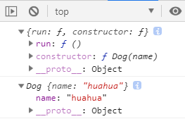
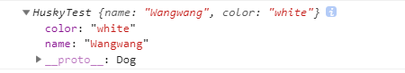

# 《`TypeScript` 开发实战》学习笔记

[TOC]

## 10. 类（1）：继承和成员修饰符 (10:24)

### 10.1. 基础类的实现

定义一个 Dog 类：

```tsx
class Dog {
    constructor(name: string) {
        this.name = name;
    }
    name: string;
    run() {}
}
```

对比 `ECMAScript`，类成员和构造函数中的 `name` 均增加了注解，并且 `constructor` 的返回值默认推断为 `Dog` 本身。

> 注意
>
> 1. 类成员的属性都是**实例属性**；类成员的方法都是**原型方法**
> 2. 实例属性**必须有初始值**，除非在构造函数中初始化


验证1：

```tsx
let dog1 = new Dog( 'huahua' );
console.log( Dog.prototype )    // {run: f, constructor: f}
console.log( dog1 )             // Dog{name: "huahua"}
```

运行结果：



验证2：

```tsx
class DogTest1 {
    constructor(name: string) { }
    // name: string;   // Error: 属性“name”没有初始化表达式，且未在构造函数中明确赋值。
    run() { }
}

// 1. 方案一：赋初值
class DogTest2 {
    constructor(name: string) { }
    name: string = 'huahua';
    run(){ }
}

// 2. 方案二：可选属性
class DogTest3 {
    constructor(name: string) { }
    name?: string;
    run() { }
}
```


### 10.2. 类的继承

定义一个 Dog 的子类 Husky：

```tsx
class Husky extends Dog {
    constructor(name: string, color: string) {
        super(name);
        this.color = color;
    }
    color: string;
}
```

`super` 指代父类实例（必填），`this` 须位于 `super` 之后


### 10.3. 类的成员修饰符

类的成员修饰符是 `TypeScript` 对 `ES` 的扩展

> **public**
>
> ​	类的所有属性默认都是 public，表示对所有成员（类本身、实例、子类等）可见
>
> **private**
>
> ​	仅当前类可见，在实例、子类中均不可访问。当修饰构造函数时，该类既不可实例化，也不能被子类继承
>
> **protected**
>
> ​	仅能在当前类、子类中访问，实例中不可访问。修饰构造函数时，表示只能被继承，不能被实例化（相当于声明基类）
>
> **readonly**
>
> ​	该属性不能被更改，且必须初始化
>
> **static**
>
> ​	类的静态成员修饰符，只能通过类名、子类名访问，实例无法访问


此外，构造函数的参数也可以加修饰符：

```tsx
class HuskyTest extends Dog {
    constructor (name: string, public color: string) {
        super( name );
        this.color = color;
    }
}
console.log( new HuskyTest( 'Wangwang', 'white' ) )
```



这里的 `public` 将 `color` 直接声明为实例属性，简化了代码


`static` 示例：

```tsx
class Dog1 {
    constructor(name: string) {
        this.name = name;
    }
    name: string;
    // private bark(){}
    // protected run(){}
    // readonly legs: number = 4;
    static food: string = "bones"
}

class Shepherd extends Dog1 {
    constructor(name: string) {
        super( name );
    }
    name: string = "unknown";   // 要么在此赋初值，要么在构造函数用 this 再次初始化，否则报错：
                                // Error: 属性“name”没有初始化表达式，且未在构造函数中明确赋值。
}

console.log( `Dog1.food: ${Dog1.food}` );          // Dog1.food: bones
console.log( `Shepherd.food: ${Shepherd.food}` );  // Shepherd.food: bones

let mydog = new Dog1( 'diandian' );
// console.log( mydog.food );  // Error: Property 'food' is a static member of type 'Dog1'
```


### 10.4. 小结：

1. 类的实现
2. 类的继承
3. 类的成员修饰符


TS 的类与 ES 的不同：

1. 成员带类型注解；
2. 类的成员修饰符。


edited by ***Anton*** -- 23:23 2019/8/20