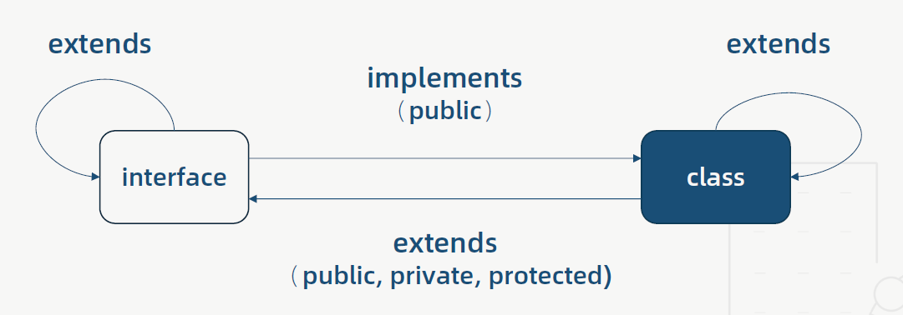

# 《`TypeScript` 开发实战》学习笔记

[TOC]

## 12. 类与接口的关系 (08:20)

### 12.1. 类必须实现接口中声明的所有属性

"类"类型接口规定了类有哪些成员，并定义其类型

```tsx
interface Human {
    name: string;
    eat(): void;
}

// 用 Asian 类实现 Human：
class Asian implements Human {
    constructor(name: string) {
        this.name = name;
    }
    name: string
    eat() {}
}
```

注意：Asian 必须实现 Human 中声明的所有属性（name、eat）

但类可以实现自己的属性：

```tsx
class Asian1 implements Human {
    constructor(name: string) {
        this.name = name;
    }
    name: string;
    eat() {
        console.log('Asian eat rice.');
    }

    sleep() { console.log('Asian sleep.') }
}
```


### 12.2. 接口只能约束类的公有成员

```tsx
interface HumanDemo {
    name: string
}
class AsianDemo implements HumanDemo {
    // private name: string    // Error: 类“AsianDemo”错误实现接口“HumanDemo”。
                            // 属性“name”在类型“AsianDemo”中是私有属性，但在类型“HumanDemo”中不是。
    constructor(name: string) {
        this.name = name;
    }
    name: string
}
```


### 12.3. 接口不能约束类的构造函数 `constructor`

```tsx
interface HumanDemo2 {
    new (name: string): void    // 1) 在接口中定义构造函数
    name: string
}
// class AsianDemo2 implements HumanDemo2 {    // 2) 用 AsianDemo2 实现 HumanDemo2：
//                                             // Error: 类“AsianDemo2”错误实现接口 
//											   // “HumanDemo2”。
//                                             // 类型“AsianDemo2”提供的内容与签名“new 
//											   // (name: string): void”不匹配。
//     constructor(name: string) {
//         this.name = name;
//     }
//     name: string
// }
```


### 12.4. 接口的继承

TS 中的接口可以像类一样相互继承，并且一个接口可以继承多个接口（与 Java 相似）

示例：

```tsx
interface Man1 extends Human {
    run(): void;
}
interface Child1 {
    cry(): void;
}
interface Boy0 extends Child1, Man1 { }

let boy1: Boy0 = {
    name: 'boy',
    eat() { console.log('boy eat') },
    run() { console.log('boy run') },
    cry() { console.log('boy cry') }
}
```

可见，接口既可以抽离出可重用的接口，也可以将多个接口合并为一个接口


### 12.5. 用接口继承类

```tsx
class AutoClass {
    state: number = 1
}
interface AutoInterface extends AutoClass {
    // 接口中隐含 state 属性
}
class C implements AutoInterface {
    // 只要类中有接口隐含的属性即可
    state: number = 2
}
```

此外，AutoClass 的子类也可以实现 AutoInterface 接口：

```tsx
class Bus extends AutoClass implements AutoInterface {
    // state 通过继承获得，无须实现
}
```


> **注意**
>
> ​	接口在抽离类的成员时，会抽离类的**公共成员**、**私有成员**、以及**受保护成员**。

示例：

```tsx
class AutoDemo2 {
    state: number = 1
    private state2: number = 2
}
interface AutoInterface2 extends AutoDemo2{ }

// 子类可以继续实现接口
class Bus2 extends AutoDemo2 implements AutoInterface2{ }

// 其他类不可实现该接口，即使结构类似 AutoDemo2：
// class D implements AutoDemo2 {  // Error: 类“D”错误实现类“AutoDemo2”。你是想扩展“AutoDemo2”并将其成员作为子类继承吗?
//                                 // Property 'state2' is missing in type 'D' but required in type 'AutoDemo2'.
//     state: number = 3
//     private state2: number = 4
// }
```


> **小结**：
>
> 1. 接口间可相互继承；（以便复用）
>
> 2. 类之间也可相互继承；（同上）
>
> 3. 接口可由类实现，但实现过程中，接口仅能约束类的共有成员；
>
> 4. 接口可以通过继承类，来抽离出类的成员，包括共有成员、私有成员和受保护成员。


### 12.6. 接口与类的关系




edited by ***Anton*** -- 22:45 2019/8/21

